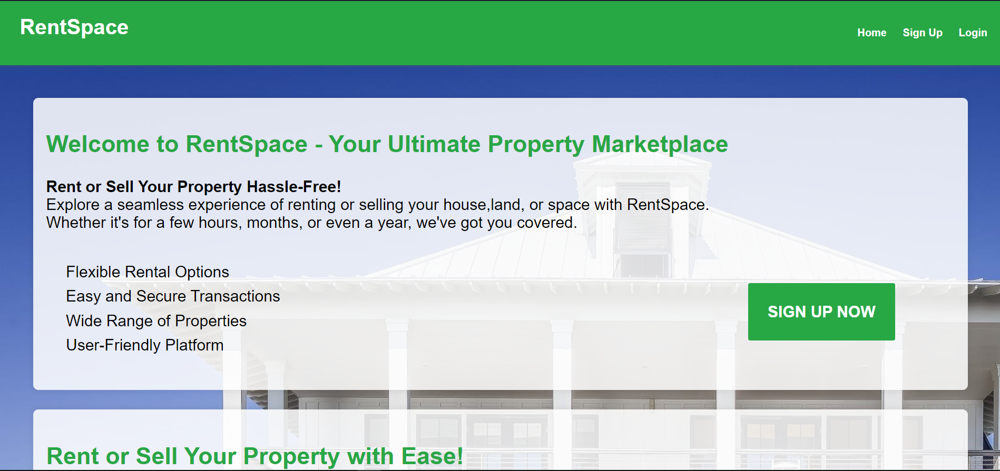

# RentSpace

**House renting with social media capability**
- a simple website for houses sellers and renters where you can rent you place by hour, month, year or even sell it.
- you can create new user account throw microsoft identity framework
- publish new place where you can view the details edit or delete it
- you can view other places and the user who created that place 
- you can have real time coummunication with him throw SignalR
- the website have some bootstrap model pops and toastr to give better visuals

